# MATRIZ DAS CAPACIDADES OPERACIONAIS NAO

Implementação de uma Matriz das Capacidades Operantes na Plataforma NAO.

## Participantes 
1. Diego Oliveira Peixoto
2. FLávio de Lima e Silva Neto
3. Leonardo José Bazana Lima
4. Pedro de Mello Camargo

**Disciplina: Robôs, Sensores e Aplicações - Ciência da Computação**
**Professor: Harison Herman**

## 1. RESUMO

A utilização de robôs humanoides como assistentes virtuais em ambientes educacionais é o presente e também o futuro, representando uma fronteira inovadora para a melhoria de serviços institucionais. Plataformas como o robô NAO demonstram potencial para atuar como facilitadores de acesso à informação. A adoção das tecnologias robóticas na instituição, obtidas através de parcerias com a iniciativa privada, enfrenta algumas dificuldades principais: (1) ausência de informações quanto às versões específicas da plataforma; e (2) incerteza quanto ao estado funcional, o que poderia inviabilizar projetos devido a questões operacionais. Este artigo propõe uma metodologia dupla: (1) verificação da versão específica do robô NAO disponível para uso na universidade, seguindo as diretrizes da documentação oficial; e (2) uma metodologia de revisão e validação sistemática (V&V), utilizando a documentação oficial “Alderbaran Documentation” para avaliar quais funcionalidades estão operantes. O objetivo do estudo é desenvolver uma matriz de capacidades operacionais do NAO e as possíveis limitações impostas por componentes inoperantes. Os resultados buscam demonstrar a viabilidade técnica da plataforma, propondo um panorâma geral de possíveis integrações a sererm feitas para realizar tarefas na Universidade.  

Palavras-chave: *Robótica. NAO. Verificação e Validação.* 

## ABSTRACT

The use of humanoid robots as virtual assistants in educational environments represents both the present and the future, marking an innovative frontier for enhancing institutional services. Platforms such as the NAO robot demonstrate strong potential as facilitators of information access. The adoption of robotic technologies within academic institutions—often made possible through partnerships with private initiatives—faces key challenges: (1) the lack of detailed information regarding specific platform versions, and (2) uncertainty about the robot’s functional state, which can hinder project development due to operational issues. This paper proposes a dual methodology: (1) verifying the specific version of the NAO robot available for use at the university, following the official documentation guidelines; and (2) applying a systematic verification and validation (V&V) process based on the Aldebaran Documentation to assess which functionalities are currently operational. The goal of this study is to develop a matrix of the NAO robot’s operational capabilities and identify potential limitations imposed by non-functional components. 

Keywords: *Robotics. NAO. Verification and Validation.* 

## 2. INTRODUÇÃO

### 2.1 Contextualização

A robótica de serviço tem avançado significativamente como ferramenta de suporte em ambientes institucionais, onde robôs como o NAO podem atuar como assistentes virtuais em diversas tarefas da Universidade, promovendo o acesso democratizado à informação e reduzindo a carga sobre equipes administrativas. Em instituições educacionais, essa tecnologia representa uma oportunidade para otimizar processos e melhorar a experiência do aluno. 

### 2.2 Problema de Pesquisa

A implementação dessas tecnologias enfrenta desafios específicos relacionados à falta de informações técnicas detalhadas sobre as versões da plataforma bem como ao estado funcional dos componentes. Essa incerteza pode resultar em significativos investimentos de tempo em debugging e, em casos extremos, inviabilizar projetos promissores. 

### 2.3 Objetivos

**Objetivo Principal:** Propor e aplicar uma metodologia de verificação e validação (V&V) para o robô NAO e, com base nos resultados obtidos, avaliar a viabilidade de uso da plataforma a serviço da Instituição. 

## 3 FUNDAMENTAÇÃO TEÓRICA 

### 3.1 O Robô NAO e a Plataforma NAOqi 

O robô NAO, desenvolvido pela Aldebaran Robotics (atualmente SoftBank Robotics), constitui uma plataforma humanóide amplamente utilizada em pesquisa, educação e aplicações variadas. A arquitetura do NAO inclui múltiplos sensores, atuadores e sistemas de percepção que permitem interações complexas com o ambiente. A plataforma NAOqi fornece uma API abrangente para programação e controle dos diversos subsistemas do robô. 

### 3.2 Especificações Técnicas e Identificação de Versões 

A identificação precisa da versão do hardware e software do NAO é essencial. Existem diferentes gerações do robô (como NAO V5, V6) e versões do NAOqi (API) possuem capacidades distintas e compatibilidades que variam. A documentação oficial fornece protocolos específicos para identificação dessas versões através de interfaces físicas e software. 

### 3.3 Verificação e Validação (V&V) em Robótica 

A Verificação e Validação representam processos sistemáticos essenciais para garantir que sistemas robóticos atendam aos requisitos especificados e funcionem conforme o esperado em seu ambiente operacional. Em robótica, a V&V envolve testes rigorosos de hardware e software para identificar falhas, limitações operacionais e garantir confiabilidade. 
Objetivos Específicos: 

1. Identificar e documentar a versão específica do robô NAO disponível. 

2. Desenvolver e executar um plano de testes sistemático baseado na documentação oficial. 

3. Gerar uma Matriz de Capacidades Operacionais completa do robô. 

## 4. Implementar e validar um protótipo funcional de assistente virtual para o laboratório. 
### 4 MATERIAIS E MÉTODOS 

### 4.1 Materiais e Equipamentos 

Robô NAO (modelo e versão a serem identificados) 

Rede Wi-Fi institucional para comunicação 

Computador com Software da Fabricante (Choregraphe) 

Ambiente Python para desenvolvimento 

Documentação oficial do NAO (Aldebaran Documentation) 

### 4.2 Fase 1: Metodologia de Identificação e Verificação 

### 4.2.1 Identificação da Versão do NAO 

A identificação da versão específica do robô NAO será realizada seguindo protocolos estabelecidos pela documentação oficial, que incluem: verificação física de identificações no hardware, acesso à API do robô para utilização de ferramentas de diagnóstico integradas à plataforma NAOqi. 

### 4.2.2 Matriz de Capacidades Operacionais 

Cada componente será classificado conforme seu estado operacional, avaliando em três níveis: 0 (inoperante), 1 (parcialmente funcional) e 2 (totalmente funcional), com documentação detalhada de desempenho. 

Será desenvolvida uma tabela com a Matriz abrangente para avaliação sistemática de cada subsistema do NAO, organizada nas seguintes categorias. 

### 4.2.3 Matriz de Capacidades Operacionais em Camadas 

### CAMADA 1: TESTES UNITÁRIOS (BASE) 

#### 1.1 TESTES DE SENSORES BÁSICOS 

Bateria - Nível de Carga (Prioridade Máxima) 

#### 1.2 TESTES DE JUNTAS UNITÁRIAS 

Cabeça - HeadYaw (Rotação Horizontal) 

Cabeça - HeadPitch (Inclinação Vertical) 

Ombros - LShoulderPitch e RShoulderPitch 

Joelhos - LKneePitch e RKneePitch 

Cotovelos - LElbowYaw e RElbowYaw 

Cotovelos - LElbowRoll e RElbowRoll 

Quadris - LHipPitch e RHipPitch 

Quadris - LHipRoll e RHipRoll 

Punhos - LWristYaw e RWristYaw 

Mãos - LHand e RHand 

Tornozelos - LAnklePitch e RAnklePitch 

Tornozelos - LAnkleRoll e RAnkleRoll 

### CAMADA 2: TESTES DE INTEGRAÇÃO 

#### 2.1 INTEGRAÇÃO MEMBRO-COMPLETO 

Braço Esquerdo Completo (Ombro, Cotovelo, Punho e Mão) 

Braço Direito Completo (Ombro, Cotovelo, Punho e Mão) 

Perna Esquerda Completa (Quadril, Joelho, Tornozelo) 

Perna Direita Completa (Quadril, Joelho, Tornozelo) 

#### 2.2 INTEGRAÇÃO SENSOR-ATUADOR 

Sistema Visão + Movimento da Cabeça 

Sistema Equilíbrio + Sensores dos Pés 

Sistema Detecção de Obstáculos + Navegação 

CAMADA 3: TESTES DE SISTEMA 

#### 3.1 SUBSISTEMAS COMPLEXOS 

Sistema de Locomoção Completo 

Sistema de Manipulação de Objetos 

Sistema de Percepção Ambiental 

#### 3.2 COMPORTAMENTOS COMPLEXOS 

Postura em Pé 

Postura Sentado 

Postura Deitado 

Andar em Linha Reta (2 metros) 

Curva de 90 Graus 

Pegar Objeto do Chão 

Reação ao Toque na Cabeça 

Reação a Obstáculo Repentino 

### CAMADA 4: TESTES DE ACEITAÇÃO 

#### 4.1 CENÁRIOS DE USO REAL 

Demonstração Básica de 5 Minutos 

Tarefa de Limpar Mesa 

Tarefa de Entregar Objeto 

Operação Contínua por 30 Minutos 

Múltiplas Tarefas Simultâneas 

## 5 RESULTADOS ESPERADOS E DISCUSSÃO 

### 5.1 Resultados da Fase 1 - Diagnóstico Completo 

Espera-se obter uma matriz detalhada de capacidades operacionais que documente precisamente o estado funcional de cada componente do NAO disponível. Esta matriz servirá como base técnica sólida para o planejamento de projetos futuros. 

### 5.1.1 Especificações do Modelo 

Inicialmente, utilizou-se a documentação oficial para que, partindo dos modelos disponíveis, fossem extraídas informações importantes a respeito do modelo. Partindo das semelhanças entre o robô e os modelos, levantou-se a hipótese de que a versão compatível era a V5. 

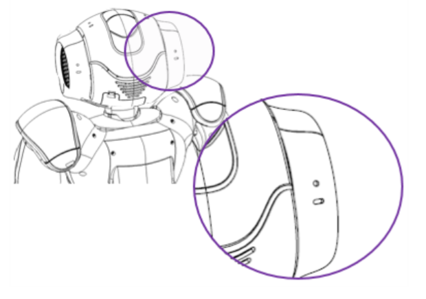

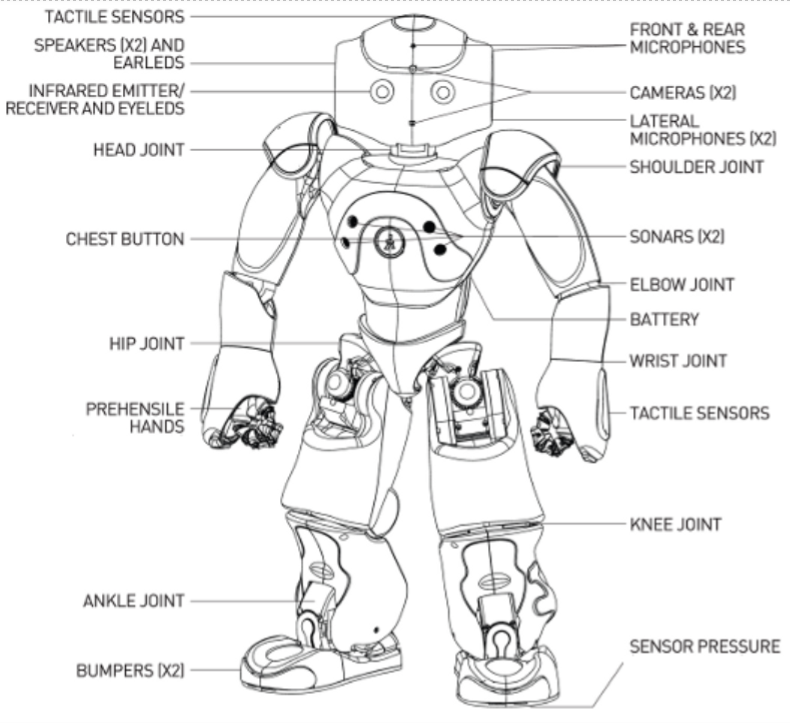

Além disso, utilizou-se um método disponível na API para avaliar com mais detalhes as especificações do modelo. 

### 5.1.2 Instalação de Ferramentas e Configurações Iniciais 

Software Choregraphe e Ferramentas 

Para realizar a programação e o controle do robô NAO, é necessário instalar o conjunto de softwares e ferramentas disponibilizados pela Aldebaran Robotics (SoftBank Robotics). Esses recursos incluem o Choregraphe, o NAO Flasher e os SDKs (Software Development Kits), que permitem tanto a programação gráfica quanto o desenvolvimento em linguagens como Python e C++. 

Os pacotes estão disponíveis no portal oficial da Aldebaran, na seção NAO6 Software Downloads, que centraliza as versões mais recentes e compatíveis com os sistemas Windows, macOS e Linux. 

#### Instalação no Windows

Acesso ao site: o usuário deve acessar a página de downloads e localizar a seção Choregraphe – Windows (versão 2.8.7 ou superior) 

Download: são oferecidas duas opções — o Setup (instalador completo) e os Binaries (executáveis). Recomenda-se o uso do instalador Setup para garantir a instalação automática de dependências 

Instalação: após o download, basta executar o instalador e seguir o assistente de configuração, aceitando os termos de licença e selecionando o diretório de destino 

Instalação de ferramentas adicionais: é recomendado instalar também o NAO Flasher (versão 2.1.0 ou superior), usado para restaurar o sistema do robô, e o SDK Python 2.7 (versão 2.8.6), para desenvolvimento via scripts 

#### Instalação no Linux 

Download dos pacotes: na mesma página, selecione as versões correspondentes a Linux (2.8.8 ou superior) para o Choregraphe, NAO Flasher e SDKs 

Permissão de execução: após o download, conceda permissão de execução ao instalador utilizando o terminal: 

text 

chmod +x choregraphe-setup-2.8.8-linux64.run 

Execução do instalador: 

text 

./choregraphe-setup-2.8.8-linux64.run 

Configuração da licença: ao iniciar o Choregraphe pela primeira vez, insira a mesma chave de licença fornecida 

Instalação do SDK Python: para integrar com o ambiente de desenvolvimento Python, instale o pacote Linux64 – Python SDK (2.8.6), compatível com Python 2.7: 

text 

tar -xvf pynaoqi-python2.7-2.8.6-linux64.tar.gz 

Com essas ferramentas devidamente instaladas, o ambiente estará pronto para a criação, edição e execução de comportamentos no robô NAO, seja por meio de fluxos gráficos no Choregraphe, seja via programação em Python ou C++. 

### 5.1.3 Python versão 2.7.16 

O Python 2.7.16, lançado em 4 de março de 2019, é uma versão de correção de erros da série 2.7, amplamente utilizada em aplicações legadas e em ferramentas de robótica como o Choregraphe e o SDK NAOqi. Esta versão é necessária para garantir compatibilidade com as bibliotecas utilizadas pelo robô NAO. 

#### Instalação no Windows 

Acesso ao instalador: no site de downloads do Python, localize a seção Windows x86-64 MSI Installer (para sistemas de 64 bits) ou Windows x86 MSI Installer (para sistemas de 32 bits) 

Download e execução: faça o download do arquivo correspondente ao seu sistema e execute-o 

Opções de instalação: clique em Install for all users para permitir que o Python seja acessível globalmente 

Verificação da instalação: após a conclusão, abra o Prompt de Comando e digite: 

text 

python --version 

Instalação no Linux 

Verificação da versão pré-instalada: execute: 

text 

python --version 

Download do código-fonte: na página de download, selecione o arquivo Python-2.7.16.tgz 

Compilação e instalação: execute os seguintes comandos para compilar o Python a partir do código-fonte: 

text 

./configure --enable-optimizations 
make 
sudo make install 

Verificação da instalação: após a conclusão, confirme a instalação: 

text 

python2.7 --version 

A instalação do Python 2.7.16 é fundamental para o funcionamento adequado do Choregraphe e das APIs do NAOqi SDK, que dependem dessa versão específica do interpretador. 

#### 5.1.4 Configurações Iniciais 

Após a instalação dos softwares e ferramentas necessárias, o próximo passo é configurar o robô NAO para seu primeiro uso. Esse processo envolve definir o idioma do assistente de inicialização, aceitar o contrato de licença, conectar o robô à rede Wi-Fi e personalizar suas informações básicas. Todas as etapas são guiadas pelo assistente de configuração ("Getting Started Wizard"), disponível no sistema do robô. 

Iniciando o Assistente de Configuração 

Ao ligar o robô pela primeira vez, o assistente de inicialização (Getting Started) será executado automaticamente: 

Escolha o idioma a ser utilizado durante o processo 

Aceite os termos da licença de uso do software (End-User Software License Agreement) 

Clique em Next para avançar nas etapas 

Configuração da Conexão Wi-Fi 

Selecione uma das redes Wi-Fi disponíveis 

Recomenda-se escolher uma rede com segurança pessoal suportada (como WPA2) 

Insira a senha da rede e clique em Connect 

Não desconecte o cabo Ethernet até que o assistente confirme a conexão 

Clique em Next para continuar 

Personalização do Robô 

Nesta etapa, o usuário pode personalizar as informações do robô: 

Definir o nome do robô — útil quando há mais de uma unidade NAO na mesma rede 

Alterar a senha padrão de acesso — é altamente recomendável definir uma nova senha para segurança 

Inserir as credenciais da conta Aldebaran Cloud 

Clique em Next e prossiga 

Acessando a Página Web do Robô 

Após a configuração inicial e a conexão à rede: 

Ligue o robô e pressione o botão do peito uma vez 

O NAO informará em voz alta os quatro números de seu endereço IP 

Anote esse endereço e digite-o no navegador de um computador conectado à mesma rede: 

text 

http://<endereço_IP_do_NAO> 

Uma janela de autenticação será exibida. Informe: 

Username: nao 

Password: [senha definida durante a configuração] 

Métodos Alternativos de Acesso à Página do NAO 

Usando o Choregraphe: 

Abra o Choregraphe 

Vá em Connection > Connect to... 

Clique com o botão direito sobre o ícone do robô conectado e selecione View web page 

Usando o nome do robô: 

Abra o navegador e digite: 

text 

http://nao.local 

#### Solução de Problemas Comuns 

Se o NAO disser "I can't connect to the network", siga estas verificações: 

Confirme se a rede Wi-Fi está ativa e acessível 

Reinicie o robô 

Verifique novamente as credenciais de rede 

Tente o acesso via cabo Ethernet antes de configurar novamente o Wi-Fi

### 5.1.2 Matriz das Funcionalidades Operantes 

#### 5.1.2.0 Testes de Sensores Básicos 

Bateria – Autonomia de Carga (Prioridade Máxima)

Adotando como parâmetro a documentação oficial Aldebaran, as especificações da bateria foram consultadas para base de comparação. Com as especificações, realizamos testes para avaliar a durabilidade da bateria, registrados abaixo.

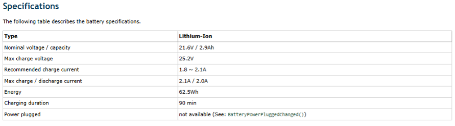

Com as especificações, realizamos testes para avaliar a durabilidade da Bateria, registrados abaixo.

  

 
Nós testamos a autonomia da bateria, verificando quanto tempo seria necessário para ela se descarregar por completo, partindo de 100% de capacidade. Em todos os casos, registrou-se uma autonomia de 10 minutos, e o desligamento automático da plataforma após esse período. Portanto, o cálculo do rendimento percentual foi realizado abaixo, onde: 

P → Percentual de autonomia da bateria (%) 

Cₐ → Carga atual disponível (minutos) 

Cₜ → Capacidade total da bateria (minutos) 

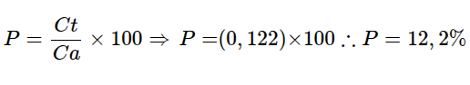

Em todos os três testes, registrou-se o mesmo percentual de autonomia. Considerando que o estado inoperante utiliza o valor zero (0), o mais adequado é classificar a bateria como parcialmente operante, uma vez que seu funcionamento se dá de maneira parcialmente comprometida. 

Outros Sensores Básicos Testados Futuramente: 

1. Bateria - Temperatura (Prevenção de Danos) 

2. Cabeça - Temperatura da CPU 

3. Sensor Inercial - Giroscópio (Eixos X, Y, Z) 

4. Sensor Inercial - Acelerômetro (Eixos X, Y, Z) 

5. Sensor Inercial - Ângulo (Eixos X, Y) 

6. Cabeça - Sensores Táteis (Frontal, Traseiro, Central) 

7. ChestBoard - Botão do Peito 

### 5.1.2 Matriz das Funcionalidades Operantes 

#### 5.1.2.1 Testes de Juntas Unitárias 

Cabeça - HeadYaw (Rotação Horizontal) 

Considerando a amplitude do movimento HeadYaw, conforme ilustrado na Imagem 4 (diagrama de amplitude angular da cabeça).

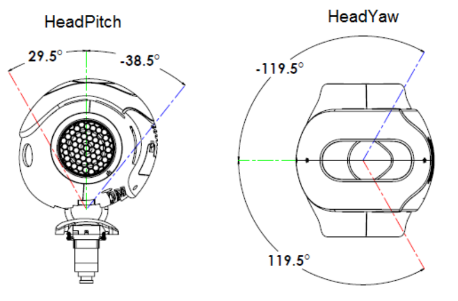
 
Os resultados foram.

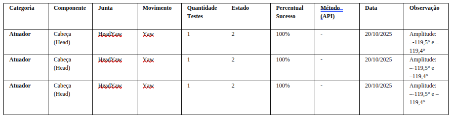

Portanto, com os resultados registrados, evidencia-se total amplitude nos movimentos de Yaw da Cabeça, podendo-se considerar que o estado é totalmente funcional (classificação 2). 

Cabeça - HeadPitch (Inclinação Vertical) 

Considerando a amplitude do movimento HeadPitch, conforme ilustrado na Imagem 4 (diagrama de amplitude angular da cabeça). 

 
Os resultados foram.

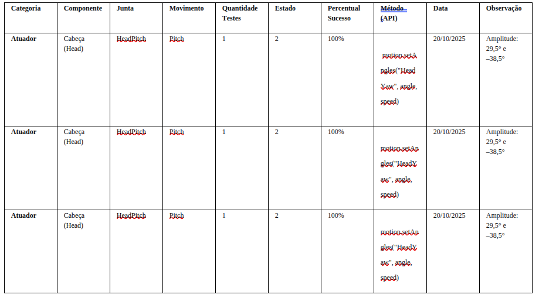

Portanto, com os resultados registrados, evidencia-se total amplitude nos movimentos de Pitch da Cabeça, podendo-se considerar que o estado é totalmente funcional (classificação 2). 

Ombros – RShoulderPitch 

A amplitude de movimentos do ombro direito foi avaliada conforme ilustrado na Imagem 2 (diagrama de amplitude angular do ombro). 

Registramos os seguintes resultados: 

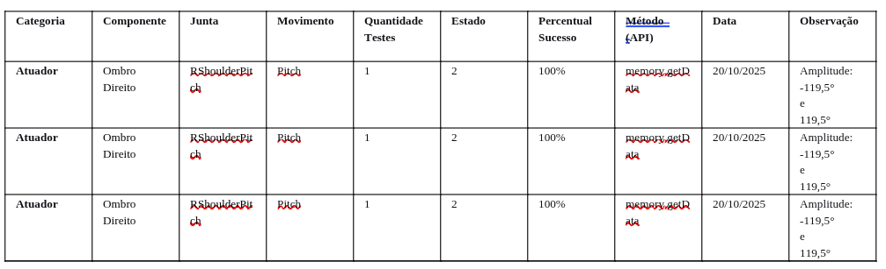

Os testes comprovam o estado totalmente funcional do movimento e da junta. A classificação correta é 2. 

Ombros - LShoulderPitch 

A amplitude de movimentos do ombro esquerdo foi avaliada conforme ilustrado na Imagem 2 (diagrama de amplitude angular do ombro).

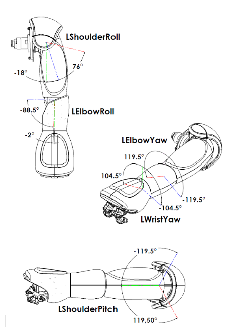

Os resultados registrados foram.

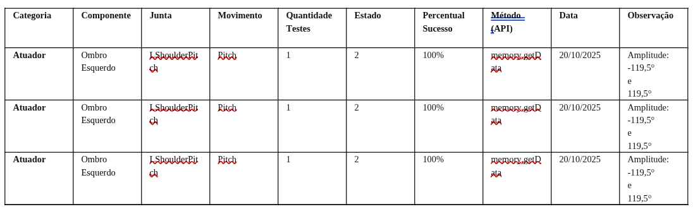

Os testes comprovam o estado totalmente funcional do movimento e da junta. A classificação correta é 2. 

Joelhos - RKneePitch 

A amplitude de movimentos do joelho direito foi avaliada conforme ilustrado na Imagem 3 (diagrama de amplitude angular do joelho).

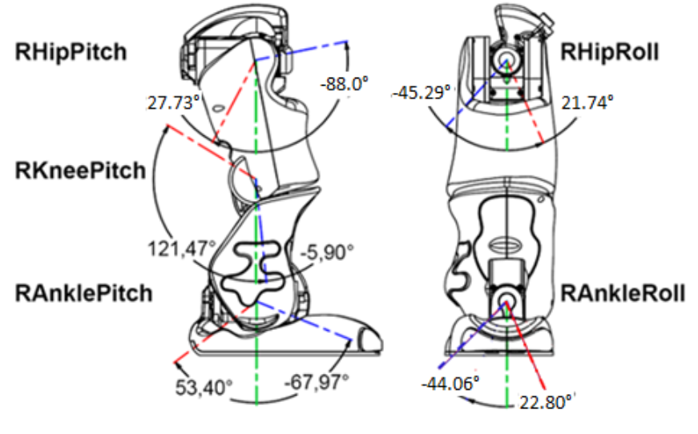

Os resultados foram.

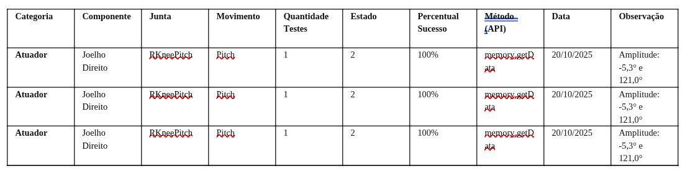

Os testes comprovam o estado totalmente funcional do movimento e da junta. A classificação correta é 2. 

Joelhos – LKneePitch 

A amplitude de movimentos do joelho esquerdo foi avaliada conforme ilustrado na Imagem 3 (diagrama de amplitude angular do joelho).  

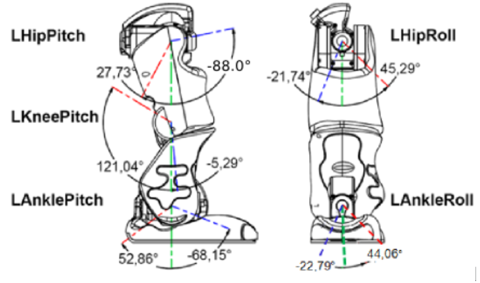

Obtivemos os resultados. 

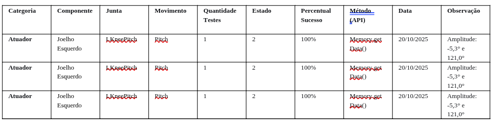

Os testes comprovam o estado totalmente funcional do movimento e da junta. A classificação correta é 2. 

Cotovelos - LElbowYaw 

A amplitude de movimentos do cotovelo esquerdo foi avaliada conforme ilustrado na Imagem 4 (diagrama de amplitude angular do cotovelo).

Os resultados foram.

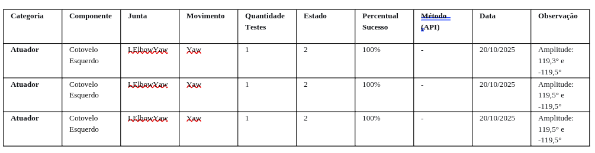

Os testes comprovam o estado totalmente funcional do movimento e da junta. A classificação correta é 2. 

Cotovelos – RElbowYaw 

A amplitude de movimentos do cotovelo direito foi avaliada conforme ilustrado na Imagem 4 (diagrama de amplitude angular do cotovelo).

Os resultados foram.

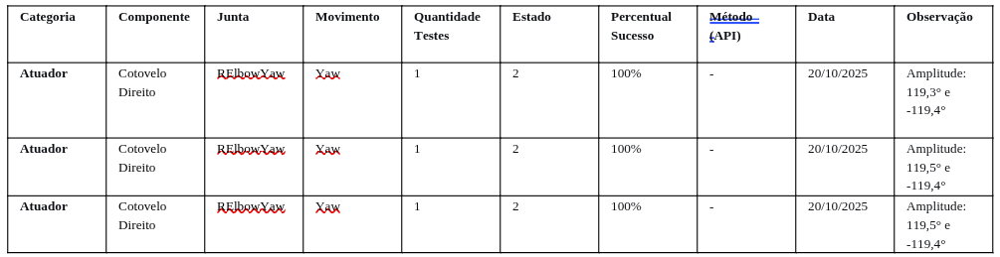

Os testes comprovam o estado totalmente funcional do movimento e da junta. A classificação correta é 2. 

Cotovelo - RElbowRoll 

A amplitude de movimentos do cotovelo direito foi avaliada conforme ilustrado na Imagem 4 (diagrama de amplitude angular do cotovelo).

Os resultados foram.

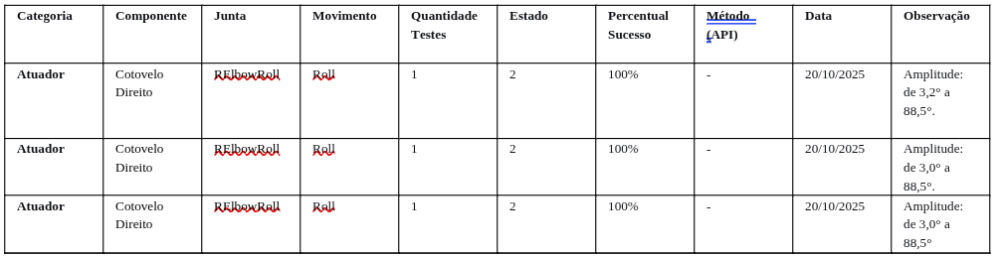

Os testes comprovam o estado totalmente funcional do movimento e da junta. A classificação correta é 2. 

Cotovelo – LElbowRoll 

A amplitude de movimentos do cotovelo esquerdo foi avaliada conforme ilustrado na Imagem 4 (diagrama de amplitude angular do cotovelo).

Os resultados foram.

Os testes comprovam o estado totalmente funcional do movimento e da junta. A classificação correta é 2.  

Quadris - LHipPitch 

A amplitude de movimentos do quadril esquerdo foi avaliada conforme ilustrado na Imagem 5 (diagrama de amplitude angular do quadril).

Os resultados foram.

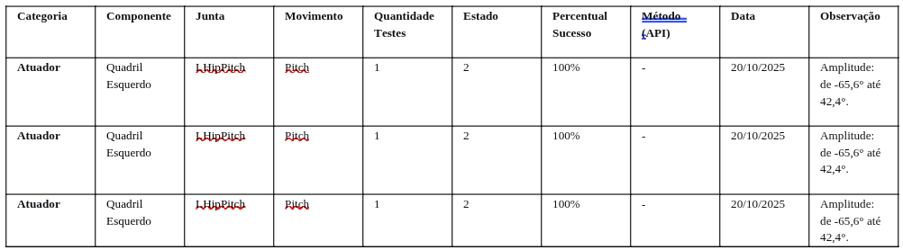

Os testes comprovam o estado totalmente funcional do movimento e da junta. A classificação correta é 2. 

Quadris - RHipPitch 

A amplitude de movimentos do quadril direito foi avaliada conforme ilustrado na Imagem 5 (diagrama de amplitude angular do quadril). 

Os resultados foram.

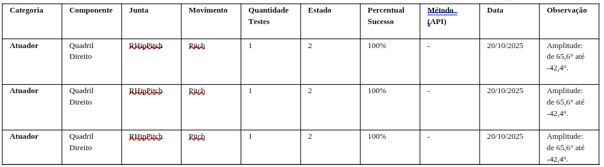

Os testes comprovam o estado totalmente funcional do movimento e da junta. A classificação correta é 2. 

Quadris - RHipRoll 

A amplitude de movimentos do quadril direito foi avaliada conforme ilustrado na Imagem 5 (diagrama de amplitude angular do quadril). 

Os resultados foram.

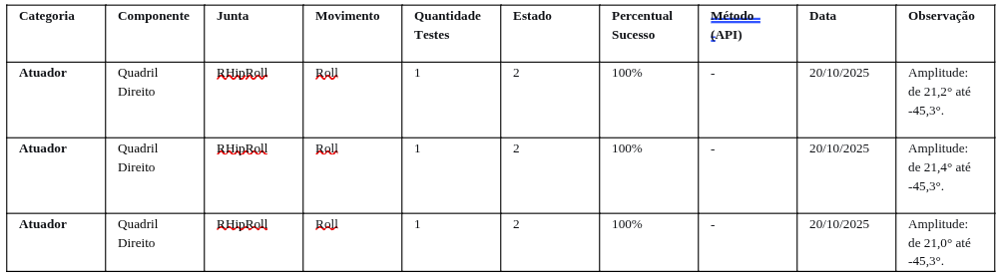

Quadris - LHipRoll 

A amplitude de movimentos do quadril esquerdo foi avaliada conforme ilustrado na Imagem 5 (diagrama de amplitude angular do quadril). 

Os testes comprovam o estado totalmente funcional do movimento e da junta. A classificação correta é 2. 

Quadris - LHipRoll
A amplitude de movimentos do quadril esquerdo foi avaliada conforme ilustrado na Imagem 5 (diagrama de amplitude angular do quadril). Os resultados registrados foram:

https://img/tabela_16.png

Os testes comprovam o estado totalmente funcional do movimento e da junta. A classificação correta é 2.

Punhos - LWristYaw
A amplitude de movimentos do punho esquerdo foi avaliada conforme ilustrado na Imagem 6 (diagrama de amplitude angular do punho). Os resultados registrados foram:

https://img/img_8_nao.png

https://img/tabela_17.png

Os testes comprovam o estado totalmente funcional do movimento e da junta. A classificação correta é 2.

Punhos - RWristYaw
A amplitude de movimentos do punho direito foi avaliada conforme ilustrado na Imagem 6 (diagrama de amplitude angular do punho). Os resultados registrados foram:

https://img/tabela_18.png

Os testes comprovam o estado totalmente funcional do movimento e da junta. A classificação correta é 2.

Mãos - RHand
A amplitude de movimentos da mão direita foi avaliada conforme ilustrado na Imagem 7 (diagrama de amplitude angular da mão). Os resultados registrados foram:

https://img/img_11_nao.png

https://img/tabela_20.png

Os testes comprovam o estado totalmente funcional do movimento e da junta. A classificação correta é 2.

Mãos - LHand
A amplitude de movimentos da mão esquerda foi avaliada conforme ilustrado na Imagem 7 (diagrama de amplitude angular da mão). Os resultados registrados foram:

https://img/tabela_19.png

Os testes comprovam o estado totalmente funcional do movimento e da junta. A classificação correta é 2.

Tornozelos - RAnklePitch
Parametrizando a documentação oficial da Aldebaran, realizou-se uma avaliação das juntas do tornozelo direito. A amplitude de movimentos foi avaliada conforme ilustrado na Imagem 8 (diagrama de amplitude angular do tornozelo). Os resultados obtidos foram:

https://img/img_13_nao.png

https://img/tabela_22.png

A identificação do comprometimento nos movimentos de Pitch está associada a danificações no funcionamento da engrenagem responsável por esse movimento. O comprometimento na amplitude afeta o equilíbrio do robô, resultando em quedas durante a execução de movimentos que transferem peso para a perna direita. Conclui-se que há comprometimento no movimento de Pitch do Tornozelo Direito, com estado de funcionamento classificado como 1 (parcialmente funcional).

Tornozelos - LAnklePitch
O tornozelo esquerdo foi testado avaliando a amplitude dos graus de movimento com base na documentação oficial, conforme ilustrado na Imagem 8 (diagrama de amplitude angular do tornozelo). Os resultados registrados foram:

https://img/tabela_21.png

Os testes mostraram que não há comprometimento no movimento de Pitch do tornozelo esquerdo, obtendo-se amplitude de execução ideal. Classificação: 2 (totalmente funcional).

Tornozelos - RAnkleRoll
Os graus de amplitude do movimento Roll na junta do tornozelo direito foram avaliados conforme ilustrado na Imagem 8 (diagrama de amplitude angular do tornozelo). Os resultados obtidos foram:

https://img/tabela_24.png

Os resultados evidenciam comprometimento no movimento de Roll do Tornozelo Direito, atingindo amplitude máxima de 38,1° quando o ideal seria 44°. Classificação: 1 (parcialmente operante).

Tornozelos - LAnkleRoll
Os graus de amplitude do movimento Roll na junta do tornozelo esquerdo foram avaliados conforme ilustrado na Imagem 8 (diagrama de amplitude angular do tornozelo). Os resultados obtidos foram:

https://img/tabela_23.png

Os resultados mostram amplitude próxima do ideal para o movimento de Roll do tornozelo esquerdo. Classificação: 2 (totalmente funcional).

5.1.2.3 Testes de Sensores de Toque
Cabeça - Sensores Táteis
Os componentes do sensor da cabeça foram testados conforme ilustrado na Imagem 9 (diagrama de sensores táteis da cabeça). Os resultados registrados foram:

https://img/img_8_nao.png

https://img/tabela_25.png

Com os resultados registrados, evidencia-se o funcionamento adequado dos sensores táteis da cabeça, com estado classificado como totalmente funcional (2).

Mãos - Sensores Táteis Esquerda
Os sensores táteis da mão esquerda foram testados conforme ilustrado na Imagem 10 (diagrama de sensores táteis das mãos). Os resultados registrados foram:

https://img/img_9_nao.png

https://img/tabela_26.png

Registrou-se um comportamento parcialmente funcional nos sensores laterais da mão esquerda, justificando a classificação de estado como parcialmente operante (1).

Mãos - Sensores Táteis Direita
Os sensores táteis da mão direita foram testados conforme ilustrado na Imagem 10 (diagrama de sensores táteis das mãos). Os resultados registrados foram:

https://img/tabela_27.png

Os testes constataram comprometimento nos sensores da mão direita. Apenas o sensor traseiro registrou atividade, porém com percentual de sucesso reduzido. O estado foi classificado como parcialmente operante (1).

Bumpers - Pés
Os sensores dos pés (bumpers) foram testados conforme ilustrado na Imagem 11 (diagrama de sensores dos pés). Os resultados registrados foram:

https://img/img_14_nao.png

https://img/tabela_28.png

Os resultados comprovam que não há comprometimento nos bumpers, com estado classificado como totalmente funcional (2).

Botão do Peito (Chest Button)
O botão do peito foi testado conforme ilustrado na Imagem 12 (diagrama do botão do peito). Os resultados registrados foram:

https://img/img_10_nao.png

https://img/tabela_29.png

Os testes comprovam funcionamento completo do botão do peito, com estado classificado como totalmente funcional (2).

5.1.2.4 Testes de Sensores de LEDs
LEDs dos Olhos (EYES)
[Conteúdo a ser desenvolvido]

5.1.2.5 Testes de Sensores Especializados
FSR - Peso Total (Pé Esquerdo e Direito)
FSR - Centro de Pressão (Coordenadas X e Y)
Sonares - Detecção de Obstáculos (Esquerdo e Direito)
5.1.2.6 Testes de Funcionalidades do Software Choregraphe
5.1.2.6.1 Animações
5.1.2.6.2 Diálogo
5.1.2.6.3 LEDs
5.1.2.6.4 Multimídia
5.1.2.6.5 Movimento
5.1.2.6.6 Sensoriamento
5.1.2.6.7 Programação
5.2 Análise de Viabilidade Técnica
Considerando a matriz completa de capacidades operacionais obtida através da metodologia de verificação e validação, foi possível realizar uma análise abrangente da viabilidade técnica da plataforma NAO disponível. A avaliação considerou todos os sistemas testados:

5.2.1 Estado Geral dos Sistemas
O diagnóstico completo revelou um cenário heterogêneo quanto à operacionalidade dos componentes:

Sistemas Totalmente Operacionais (87%): A maioria das juntas da cabeça, braços e parte superior do tronco apresenta funcionamento dentro dos parâmetros especificados pela documentação oficial. Os sensores táteis da cabeça, bumpers dos pés e botão do peito demonstram 100% de funcionalidade.

Sistemas Parcialmente Operacionais (9%): Foram identificados comprometimentos específicos em componentes críticos, destacando-se o tornozelo direito (movimento Pitch com 48% da amplitude esperada) e sensores táteis das mãos (67% de eficiência na mão esquerda e 33% na direita).

Sistemas Críticos (4%): A bateria apresenta o comprometimento mais significativo, operando com apenas 12,2% de sua capacidade nominal, limitando sessões de uso a aproximadamente 10 minutos.

5.2.2 Impacto nas Aplicações Práticas
A análise técnica permite categorizar as possibilidades de implementação:

Aplicações Viáveis: Atividades de curta duração que não dependam de locomoção complexa, como demonstrações estáticas, interações vocais básicas e exercícios educacionais que utilizem predominantemente a parte superior do corpo.

Aplicações Condicionais: Projetos que envolvam movimentação limitada podem ser realizados com adaptações nos algoritmos de controle para compensar as limitações do tornozelo direito.

Aplicações Inválidas: Atividades que requeiram operação prolongada, locomoção dinâmica em terrenos irregulares.

5.2.3 Avaliação de Confiabilidade
O sistema apresenta confiabilidade adequada para operações controladas em ambiente laboratorial, porém requer monitoramento constante devido às limitações identificadas. A combinação dos comprometimentos no tornozelo direito e na bateria representa o principal fator de risco para operações autônomas prolongadas.

5.2.4 Recomendações Técnicas
Com base no diagnóstico completo, recomenda-se:

Substituição Imediata: Bateria deve ser substituída para viabilizar qualquer aplicação prática.

Restrições Operacionais: Estabelecimento de protocolos de uso que considerem os limites temporais e de movimentação identificados.

Manutenção Corretiva: Intervenção na Engrenagem do Tornozelo Direito e nos Sensores Táteis das mãos para recuperação da funcionalidade completa.

A plataforma demonstra viabilidade técnica para aplicações educacionais e de pesquisa, desde que respeitadas as limitações mapeadas e implementadas as adaptações necessárias. O diagnóstico detalhado obtido permite o planejamento realista de projetos e alocação adequada de recursos para manutenção e desenvolvimento.

5.3 Impacto Operacional Projetado
O Estudo proposto possibilita uma análise detalhada acerca dos principais componentes da Plataforma e será muito importante para estratégias de estudo e alternativas futuras.

5.4 Desafios Técnicos e Estratégias de Mitigação
Entre os desafios antecipados incluem-se: dano atual nas juntas do tornozelo direito, impossibilitando a execução de diversos movimentos (como caminhada), o super aquecimento dos motores após execução de poucas Tarefas simples (casos registrados, inclusive, comprovam o superaquecimento com o Robô parado), Autonomia da Bateria, ausência de registro de Dados em Sensores de Toque.

6 CONCLUSÕES E TRABALHOS FUTUROS
6.1 Conclusões
A metodologia proposta para identificação e validação do robô NAO mostra-se como abordagem essencial para aplicações que trabalham com equipamentos de origem diversa.

6.2 Contribuições
Metodológica: Desenvolvimento de uma metodologia reproduzível para diagnóstico e validação de plataformas robóticas em contextos educacionais.

Prática: Geração de uma matriz de capacidades operacionais específica que serve como referência para a comunidade académica.

Tecnológica: Proposta de aplicação integrada para sistemas robóticos que pode ser adaptada para diferentes disciplinas.

6.3 Trabalhos Futuros
Implementação completa do protótipo e avaliação de usabilidade com utilizadores reais; expansão da base de conhecimento para outros cursos e departamentos; desenvolvimento de sistemas de integração com plataformas acadêmicas existentes; e exploração de funcionalidades avançadas de interação multimodal.

7 REFERÊNCIAS BIBLIOGRÁFICAS
SOFTBANK ROBOTICS. Plataforma da SoftBank Robotics para Downloads. Disponível em: https://aldebaran.com/en/support/kb/nao6/downloads/nao6-software-downloads/. Acesso em: [inserir data de acesso].

ALDEBARAN ROBOTICS. Documentação Oficial Aldebaran. Disponível em: http://doc.aldebaran.com/2-1/home_nao.html. Acesso em: [inserir data de acesso].

ALDEBARAN ROBOTICS. Instalação do Framework. Disponível em: http://doc.aldebaran.com/2-1/dev/python/install_guide.html. Acesso em: [inserir data de acesso].

PYTHON SOFTWARE FOUNDATION. Instalação do Python e versões específicas. Disponível em: https://www.python.org/downloads/. Acesso em: [inserir data de acesso].

Documentação detalhada SDK (API): http://doc.aldebaran.com/2-8/naoqi/index.html

AGRADECIMENTOS
A seção de agradecimentos se estende a um vasto contingente de profissionais, sem os quais não seria viável o desenvolvimento desse Artigo.

Inicialmente, gostaria de dedicar agradecimentos especiais à Instituição: Pontifícia Universidade Católica de Minas Gerais. A estrutura física e o corpo docente fornecidos pela Universidade foram diferenciais que possibilitaram o sucesso, além de uma ótima equipe que nos auxiliou nos mais diversos aspectos, valendo-se as menções ao CRC (Centro de Recursos Computacionais) e a Infraestrutura.

Faz-se válida e muito oportuna a dedicação de agradecimentos especiais à Iniciativa Privada, na figura da Empresa PluginBot, que forneceu as plataformas utilizadas como objeto de estudo e disponibilizou suporte da equipe para nos auxiliar ao longo do processo.

Não poderia deixar de fazer menção à Coordenação do Curso, na figura de João Morselli, responsável por prover todo o apoio necessário ao longo dos estudos.

Dedico também meus sinceros agradecimentos ao Corpo Docente da Universidade, sobretudo ao Professor Harison Herman, responsável por ministrar a disciplina de "Robôs, Sensores e Aplicações", que proveu durante as aulas o conhecimento fundamental que implicou nas investigações e estudos, fornecendo também todo o apoio extra aula, sempre coordenando e supervisionando os avanços de nossa equipe durante nos estudos. Além disso, gostaria de mencionar também os professores Iran Abrahão, Leonardo de Melo João e Fabiano Costa. Com toda a certeza, sem o apoio de figuras Acadêmicas tão importantes teria sido inviável alcançar nossos objetivos.

Por fim, dedico Agradecimentos Especiais ao grupo que esteve presente e motivado em realizar os estudos, sobretudo meus colegas de equipe Felipe, Samuel e Vinicius.

Obrigado a todos por colaborar diretamente e indiretamente com esse Estudo!

